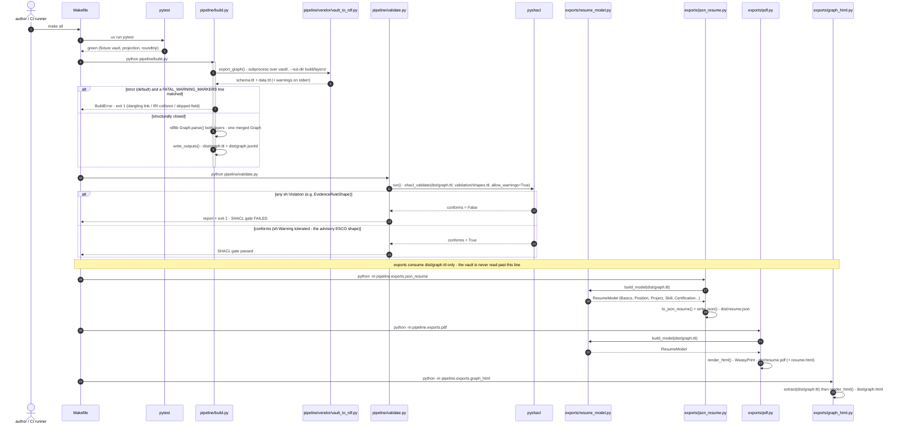
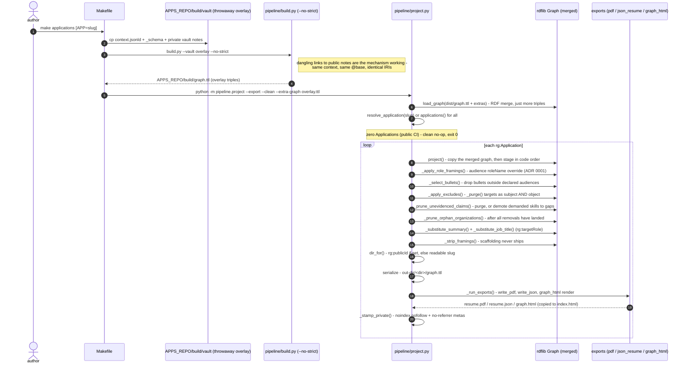
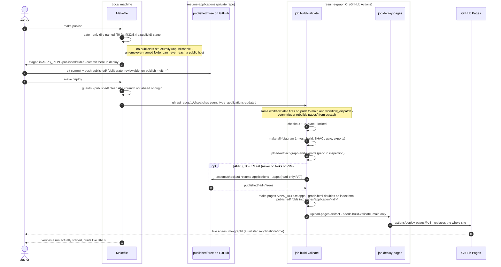

# Architecture — sequence diagrams

As-built view of the pipeline (M1–M3) plus the publishing path. The Astro site
(M4/M5) and the Neo4j layers (M7/M8) don't exist yet and are not depicted.
Authored in Mermaid; a Lucidchart port can trace these once the shapes settle.

Three diagrams, one per lifecycle: the diagrams share participants (build.py,
the exports) but each runs from a different trigger with a different contract,
and folding them into one sequence would bury the two properties worth seeing —
the gate ordering in `make all` and the trust boundary in publishing.

## 1. `make all` — build, gate, export

Two gates, in a deliberate order: `build.py` fails on *structural* problems
(dangling wiki links, IRI collisions) before SHACL is even worth running, then
`validate.py` applies the *semantic* shapes (evidence rule, datatypes).
Every export reads `dist/graph.ttl` — never the vault.

- `build.py` runs the vendored exporter as a **subprocess**, not an import — the
  pinned tool keeps its own CLI contract, and patches stay diffable against PIN.
- `ResumeModel` is the shared read model: `json_resume` and `pdf` never touch
  rdflib themselves, so a projected graph swaps in with zero export changes.
- `graph_html` bypasses `ResumeModel` deliberately — it renders the *graph*
  (nodes, edges, categories), not the résumé document shape.

## 2. `make applications` — overlay build + projection

Mechanism lives here, data and artifacts live in the private repo. The overlay
is a throwaway vault: this repo's `context.jsonld` + `_schema` copied under the
private notes so `[[Application]]` resolves. `--no-strict` is correct **here
and nowhere else** — links to public notes are intentionally dangling; the same
`@base` mints byte-identical IRIs and the RDF merge in `project.py` unifies
them.

- Stage order is load-bearing at three points, all annotated in `project.py`:
  claim pruning must follow excludes, org pruning must follow every removal,
  framings are stripped last because roleName substitution still reads them.
- The exports are unchanged and unaware — they take a graph path, so a
  projection is just a different `graph.ttl` pointed at the same code.
- `_stamp_private` is unconditional: any projected page may later be copied to
  a public host, so it carries its own refusal from birth.

## 3. Publishing — `make publish` → `make deploy` → CI → Pages

The trust boundary: nothing employer-shaped ever enters this repo's git
history. Publishing is a deliberate git commit in the *private* repo; the
public CI checks that tree out at deploy time and it exists only inside the
ephemeral Pages artifact.

- The applications checkout runs on **every** deploy, not just dispatches —
  Pages replaces the whole site each time, so a conditional fetch would let a
  routine push to main silently delete the application pages.
- `make deploy`'s guards exist because CI serves the *pushed* `published/`
  tree: a local publish never committed deploys nothing, silently — the one
  failure this mechanism invites.
- `make pages` is the single definition of the deployable tree; CI runs the
  same target as `make serve` locally, so preview and deploy cannot drift.
